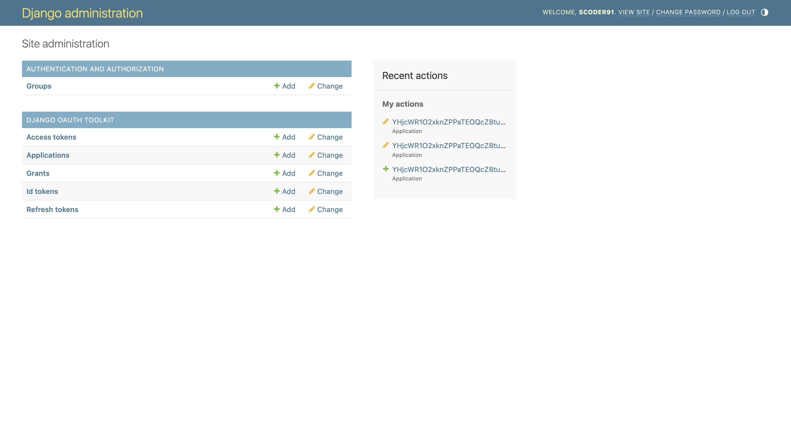
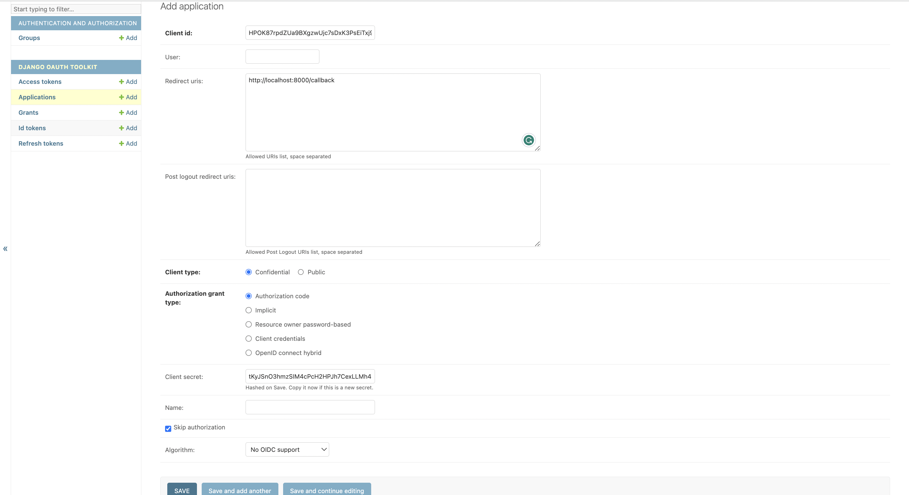

# Social Media Application Backend

The Project is a social media application backend designed using Django and (Django Rest Framework) DRF.

**API Included**

1. Signup API
2. Verify Email
3. Login API : Generates OAuth 2.0 URL
4. Get User Info API
5. Search Connections API
6. Get All Connections
7. Add Connection
8. Approve Connection
9. Disconnect
10. Get, Create & Delete Post API
11. Like & Unlike Post API
12. Get All Likes for a user or a post
13. Add & Delete Comments 
14. Get All Comments for a user or a post

**In The project**

- Have used sqlite database, can be changed to postgresql.
- Application credentials are stored in configration inside a json file, this can be changed to vault.
- For testing purpose postman script is included.
- Admin panel is created at localhost:8000/admin.
- Django Signal is used for sending email whenever a new user is registered.
- For request validation custom middleware is being used. 
- Used Custom Caching for serializer with Django Signal on cache being updated and removed based on Model Instance Update or delete.
- Local Memory Caching is being used which can be changed based.
- No Password Hasher is used.

## Setup Project

#### 1. Clone

```shell
git clone https://github.com/dextrop/socialmediabackend.git
```

#### 2. Install Dependencies

```shell
make install
```
*Make sure you are using virtual environment with python 3.7+ for the project.*


#### 3. Migrate Database

```shell
make migrate
```

*for the current project we are using sqlite database, external database can also be added.*


#### 4. Create SuperUser

```shell
make createsuperuser
```

*The project requires a super user for creating OAuth Application, We will use the user in django admin to create an OAuth Application*

#### 5. Create OAuth Application

- Make sure migration is done before going through below step.
- Run project using `make run`
- Navigate to [http://localhost:8000/admin/](http://localhost:8000/admin/) and login with your creentials

- Once Logged in Go to application


- Click on create new application and fill the below information
  - `Callback`: `http://localhost:8000/callback`
  - `Client type`: `Confidential`
  - `Authorization grant type`: ` Authorization code`
  - `Skip authorization`: Checked

*make sure you copy client_secret before saving the application*



- Create an .env file with below information

```
BASE_URL=http://localhost:8000
OAUTH_CLIENT_SECRET=CLIENT_SECRET
```

Replace the `CLIENT_SECRET` with `client_secret` copied before, also you can replace the base url to IP or domain if the project is hosted on a server.

## Setup Configration & Run

Rename file `socialmediabackend/sample-config.json` to `config.json` and fill the OAUTH configration with a `BASE32_SECRET_TOTP` for OTP. 
To generate a Base32 Secret key use.

```python
import pyotp

pyotp.random_base32()

```

**Run project**

```shell
make run
```

## Test API's

To test the api's use the postman script provided inside scripts. The postman script include API and Environment configration, make sure your environment variable is constant before using it.